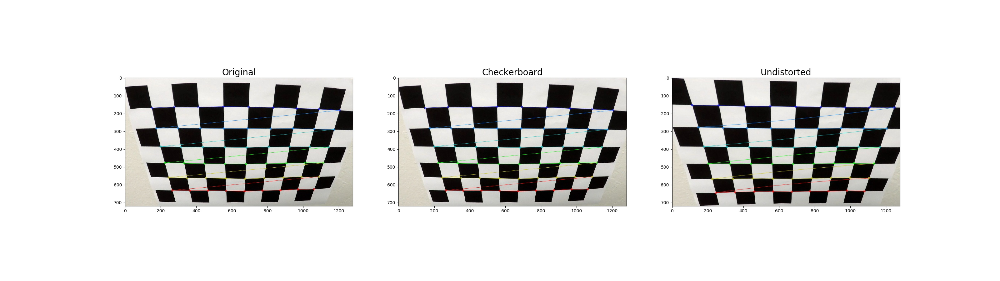
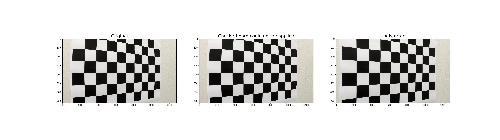
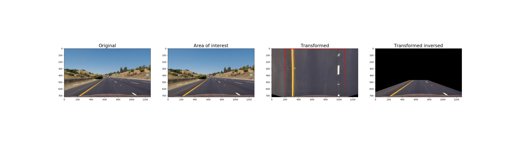

## Advanced Lane Finding Project

The goals / steps of this project are the following:

* Compute the camera calibration matrix and distortion coefficients given a set of chessboard images.
* Apply a distortion correction to raw images.
* Use color transforms, gradients, etc., to create a thresholded binary image.
* Apply a perspective transform to rectify binary image ("birds-eye view").
* Detect lane pixels and fit to find the lane boundary.
* Determine the curvature of the lane and vehicle position with respect to center.
* Warp the detected lane boundaries back onto the original image.
* Output visual display of the lane boundaries and numerical estimation of lane curvature and vehicle position.


## [Rubric](https://review.udacity.com/#!/rubrics/571/view) Points

### Camera Calibration

The code for the camera calibration can be found in the [CameraCalibration](camera_calibration.py) class. An instance of this class can be obtained through 
[CameraCalibration#default()](https://github.com/ivovandongen/CarND-Advanced-Lane-Lines/blob/master/camera_calibration.py#L60) which takes care of loading / storing
the calibration in a pickle file as it only needs to be done once.

The actual calibration is done in [CameraCalibration#calibrate()](https://github.com/ivovandongen/CarND-Advanced-Lane-Lines/blob/master/camera_calibration.py#15)

I start by preparing "object points", which will be the (x, y, z) coordinates of the chessboard corners in the world. Here I am assuming the chessboard is fixed on the (x, y) plane at z=0, 
such that the object points are the same for each calibration image.  Thus, `objp` is just a replicated array of coordinates, and `objpoints` will be appended with a copy of it every time I 
successfully detect all chessboard corners in a test image.  `imgpoints` will be appended with the (x, y) pixel position of each of the corners in the image plane with each successful chessboard detection.  

I then used the output `objpoints` and `imgpoints` to compute the camera calibration and distortion coefficients using the `cv2.calibrateCamera()` function.  

I applied this distortion correction to the test image using the `cv2.undistort()` [CameraCalibration#undistort()](https://github.com/ivovandongen/CarND-Advanced-Lane-Lines/blob/master/camera_calibration.py#48) function in and obtained this result:





### Pipeline (single images)

#### 1. Distortion correction

To demonstrate this step, I will describe how I apply the distortion correction to one of the test images like this one:


It's subtle, but best observed by looking at the hood of the car.

#### 2. Color and gradient thresholds

To find a good set of transformations I plotted a variety of options on all the test images (and lateron problematic video frames):


I ended up using a combination of color and gradient thresholds to generate a binary image. This may be found in [thresholding.py](https://github.com/ivovandongen/CarND-Advanced-Lane-Lines/blob/master/thresholding.py#L88)

An example of the binary result image (and the stacked color representation of the different filter contributions):


#### 3. Perspective transform

The code for my perspective transform may be found in the [PerspectiveTransform](transform.py) class.

[PerspectiveTransform#default()](https://github.com/ivovandongen/CarND-Advanced-Lane-Lines/blob/master/transform.py#L52) creates a new instance based on the
dimensions of the input image. 

```python
        poly_height = int(height * .35)
        bottom_offset_left = 60
        bottom_offset_right = bottom_offset_left
        bottom_margin = 0
        top_offset = 94
        polygon = [[bottom_offset_left, height - bottom_margin],
                   [width // 2 - top_offset, height - poly_height],
                   [width // 2 + top_offset, height - poly_height],
                   [width - bottom_offset_right, height - bottom_margin]]

        margin_x_bottom = 200
        margin_x_top = 200
        dst_height = height #* 3
        dst_width = width
        dst = [[margin_x_bottom, dst_height],
               [margin_x_top, 0],
               [dst_width - margin_x_top, 0],
               [dst_width - margin_x_bottom, dst_height]]
        return PerspectiveTransform(np.float32(polygon), np.float32(dst), src_size=(height, width),
                                    dst_size=(dst_height, dst_width))
```

The perspective transform is passed around in order to contain the logic within. In cases where the inverse transform is needed, the transform may be inverted with 
[PerspectiveTransform#invert()](https://github.com/ivovandongen/CarND-Advanced-Lane-Lines/blob/master/transform.py#L40)

This resulted in the following source and destination points:

| Source        | Destination   | 
|:-------------:|:-------------:| 
| [60, 720]     | [200, 720]    | 
| [546, 469]    | [200, 0]      |
| [734, 469]    | [1080, 0]     |
| [1220, 720]   | [1080, 720]   |

I verified that my perspective transform was working as expected by drawing the `src` and `dst` points onto a test image and its warped counterpart to verify that the lines appear parallel in the warped image.



#### 4. Identify lane-line pixels and fit their positions with a polynomial

The code to identify the lane line pixels and fit polynomials to them can be found in [line_locator.py lines 40-124](https://github.com/ivovandongen/CarND-Advanced-Lane-Lines/blob/master/line_locator.py#L40-L124)

The following steps are taken:
- A histogram is made from the bottom half of the image to find a peak on the left and right side
- Then the image is traversed up in windows of a pre-defined size to follow these peaks and find the lines
- Finally for both lines a polynomial is fit using opencv

The result looks like:


#### 5. Lane curvature and position of car in lane.

The lane curvature is first calculated per lane line in [LaneLine#calculate_curvature_m()](https://github.com/ivovandongen/CarND-Advanced-Lane-Lines/blob/master/lane_line.py#L20).
Then the average of both lines is calculated per detection frame in the [DetectionFrame](https://github.com/ivovandongen/CarND-Advanced-Lane-Lines/blob/master/lane.py#L63) constructor.
These are then averaged over the available history in [Lane#_curve_radius_average()](https://github.com/ivovandongen/CarND-Advanced-Lane-Lines/blob/master/lane.py#L120)

The offset of the car from the lane center is calculated per detection frame in the [DetectionFrame](https://github.com/ivovandongen/CarND-Advanced-Lane-Lines/blob/master/lane.py#L65) ctor
as well

#### 6. Example of detected lane surface back on original image.

The lane overlay is added to the original image in [lane.py](https://github.com/ivovandongen/CarND-Advanced-Lane-Lines/blob/master/lane.py#L14). The needed Transform
instance is passed so the plotted polygon can be transformed back from birds-eye perspective.


---

### Pipeline (video)

Here's a [link to my video result](./output_videos/processed_project_video.mp4)

[](http://www.youtube.com/watch?v=r8472RcEoqU)

---

### Discussion

Using thresholding to clearly mark lane lines proofed very finicky and breaks down quickly under a number of conditions:
- shadows
- poorly drawn lane lines
- poor lighting conditions
- extranious markings / cracks in the road

To combat these issues, fine-tuning and combination of many more filters might help. Although the result seems to remain quite
brittle in the end.

Another issues seems that doing any sort of calculations on the images seems to be subject to a high error rate. Curves and distances are not
that easy to determine accurately.

Finally, having to calibrate a camera makes this solution difficult to implement with arbitrary end-user hardware. Having a user go through these calibration
steps might be asking too much. 
